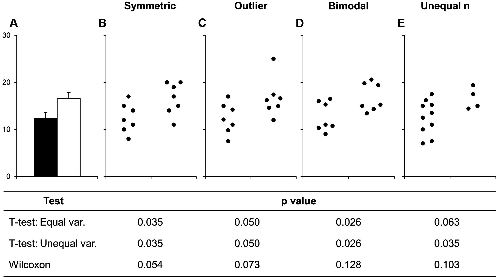

name: intended-audience

```{r load-libraries, echo = FALSE, message=FALSE, warning=FALSE}
library(tidyverse)
library(cowplot)
library(ggbeeswarm)
library(raincloudplots)
library(ggridges)
```


# What to expect

- New to R
- Familiar with R, but new to data visualization in R
- Basic intro with little code
- You can go ahead and produce plots, but you shouldn't
- There's only so much you can do in 45 min

---
name: outline

# Outline

1. Why visualization is important
2. Some basic principles of data visualization
3. Why R (and ggplot2)?
4. Some basic examples
5. Questions

---
class: inverse, center, middle

# 1. Why visualization is important

---
name: why-visualize

# Why bother?

- Data visualization translates raw data into graphs
- From data to meaning
- Recognize patterns and trends
- Easier to understand
- But comes with huge responsibility!

---
name: anscombe

# Anscombe's Quartett


.small[<https://en.wikipedia.org/wiki/Anscombe%27s_quartet>]
---
name: datasaurus

# Datasaurus Dozen


.small[(Alberto Cairo, <https://www.autodesk.com/research/publications/same-stats-different-graphs>)]
---
name: fox-news

# What responsibility?


.small[(Recreate properly with ggplot2: <http://freerangestats.info/blog/2020/04/06/crazy-fox-y-axis>)

(More examples: <https://www.reddit.com/r/dataisugly/>)]
---
name: propaganda

# What responsibility?

.pull-left[]

.pull-right[
- Hiding relevant data to highlight what benefits us
- Displaying too much data to obscure reality
- Using graphic forms in inappropriate ways (distorting the data)
]

.small[(Cairo, A. (2015). Graphics lies, misleading visuals. In New challenges for data design (pp. 103-116). Springer, London.)]

---
name: distorted-academia

# What responsibility?

```{r echo=FALSE}
dat <- 
  tibble(
    Value = c(3.7, 4.1),
    Group = c("Control", "Treatment")
  )
```

.pull-left[
```{r echo=FALSE}
ggplot(dat, aes(x = Group, y = Value)) +
  geom_bar(stat = "identity")
```
]

.pull-right[
```{r echo=FALSE}
ggplot(dat, aes(x = Group, y = Value)) +
  geom_bar(stat = "identity") +
  ylim(c(0,100))
```
]

---
class: inverse, center, middle

# 2. Some basic principles of data visualization

---
name: principles1

# Principles

1. **Keep it simple and stupid**

.pull-left[
```{r echo=FALSE}
dat <- 
  tibble(
    x = rnorm(100),
    y = 0.2 * x + rnorm(100),
    gender = rep(c("men", "women"), each = 50)
  )

ggplot(data = dat, aes(x, y, color = gender)) +
  geom_point()
```
]

.pull-right[
```{r echo=FALSE}
ggplot(data = dat, aes(x, y, color)) +
  geom_point() +
  theme_cowplot()
```

]
---
name: principles2

# Principles

1. Keep it simple and stupid
2. **Show your data**




.small[(From Weissgerber, T. L., Milic, N. M., Winham, S. J., & Garovic, V. D. (2015). Beyond bar and line graphs: time for a new data presentation paradigm. PLoS Biol, 13(4), e1002128.)]
---

name: principles2.2

# Principles

1. Keep it simple and stupid
2. **Show your data**


.small[(From <https://www.kickstarter.com/projects/1474588473/barbarplots>)]
---
name: principles3

# Principles

1. Keep it simple and stupid
2. Show your data
3. **Data-to-ink ratio (Tufte)**

.pull-left[

]

.pull-right[

]

.small[(From <https://infovis-wiki.net/wiki/Data-Ink_Ratio>)]
---
name: principles4

# Principles

1. Keep it simple and stupid
2. Show your data
3. Data-to-ink ratio (Tufte)
4. **Know what you want to communicate**

.pull-left[
```{r echo=FALSE}
ggplot(data = dat, aes(x, y, color = gender)) +
  geom_point() +
  facet_wrap(~ gender) +
  theme_cowplot() +
  theme(legend.position = "none")
```
]

.pull-right[
```{r echo=FALSE}
ggplot(data = dat, aes(x, color = gender)) +
  geom_density() +
  theme_cowplot()
```
]
---
name: principles5

# Principles

1. Keep it simple and stupid
2. Show your data
3. Data-to-ink ratio (Tufte)
4. Know what you want to communicate
5. **In proportion and with correct axes**

.pull-left[

]

.pull-right[

]

.small[(From <https://blog.datawrapper.de/dualaxis/>)]
---
name: principles6

# Principles

1. Keep it simple and stupid
2. Show your data
3. Data-to-ink ratio (Tufte)
4. Know what you want to communicate
5. In proportion and with correct axes
6. **Use color, size, position to make clear what's important**

.pull-left[
```{r, echo=FALSE, message=FALSE}
dat <- 
  tibble(
    gender = rep(c("men", "women"), each = 100),
    x = rnorm(200)
  ) %>% 
  mutate(
    y = if_else(gender == "men", x * 0.1 + rnorm(100), x * 0.8 + rnorm(100))
  )

ggplot(dat, aes(x, y, shape = gender))+
  geom_point() +
  geom_smooth(method = "lm", color = "black")
```

]

.pull-right[
```{r echo=FALSE, message=FALSE}
ggplot(dat, aes(x, y, color = gender))+
  geom_point() +
  geom_smooth(method = "lm") +
  theme_cowplot()
```
]
---
class: inverse, center, middle

# 3. Why R (and ggplot2)?

---
name: why-ggplot

# Why R (and ggplot2)?

- Reusable, reproducible, efficient
- `ggplot2` de facto standard for R users
- Flexible, highly customizable
- Consistent underlying logic in creating graphs: (Layered) grammar of graphics
- Publication-level output
- Active user base with infinite resources online (Stackoverflow etc.)
- Pretty

---
name: ggplotbook

# Go-to resource


<https://ggplot2-book.org/index.html>

---
name: grammar1

# Grammar of graphics

> In brief, the grammar tells us that a **graphic maps the data to the aesthetic attributes (colour, shape, size) of geometric objects** (points, lines, bars).

> The grammar makes it easier for you to **iteratively update a plot, changing a single feature at a time**. The grammar is also useful because it suggests the high-level aspects of a plot that can be changed, giving you a framework to think about graphics, and hopefully **shortening the distance from mind to paper**. It also encourages the use of graphics customised to a particular problem, rather than relying on specific chart types.

---
name: grammar2

# Grammar of graphics


- Think of the layers as building blocks
- Combine and shuffle them to create any kind of graph you want
- The use of these layers is hierarchical and logically consistent

.small[(From <https://towardsdatascience.com/a-comprehensive-guide-to-the-grammar-of-graphics-for-effective-visualization-of-multi-dimensional-1f92b4ed4149>)

(See Wickham's [paper](http://vita.had.co.nz/papers/layered-grammar.pdf))]
---
name: layers

# So what are these layers?

- **data**: observations organized as variables
- **aesthetic mapping**: maps variables in the data to aesthetic qualities/categories (e.g., variables to color or shape)
- **scales**: implement the mapping, turning values in the data into values in the graph (e.g., how groups get assigned colors, create axes and legends)
- **geometric objects (geoms)**: turns values in the data into geometric objects ((e.g., points, lines)
- **stats**: summarize and transform data values
- **facets**: how shall we "split up" the graph into displaying subsets of the data
- **coord**: coordinate system, how are data coordinates translated to the space of the graph
- **themes**: fine-tune the looks of your graph
---
name: layers-data1

# Data

```{r, echo=FALSE}
knitr::kable(head(mtcars), format = "html")
```
```{r echo=FALSE}
my_cars <- 
  mtcars %>% 
  mutate(
    cyl = as.factor(cyl)
  )
```

---
name: layers-data2

# Data
.pull-left[
Nothing happens yet: We just told `ggplot2` what data to translate to a graph.
```{r, eval=FALSE}
ggplot(data = my_cars)
```
]

.pull-right[
```{r, eval=TRUE, echo=FALSE}
ggplot(data = my_cars)
```
]
---
name: layers-aesthetics

# Aesthetic mapping

.pull-left[
Next, we tell `ggplot2` what variables to map to which properties: the `mpg` variable to the x axis and the `disp` variable to the y axis.
```{r, eval=FALSE}
ggplot(
  data = my_cars,
  aes( #<<
    x = mpg, #<<
    y = disp #<<
  ) #<<
)
```
]

.pull-right[
```{r, echo=FALSE}
ggplot(
  data = my_cars,
  aes( #<<
    x = mpg, #<<
    y = disp #<<
  ) #<<
)
```
]

---
name: layers-geoms

# Geoms

.pull-left[
Time to translate those mappings into something we can see: a point for each x-y-combination.
```{r, eval=FALSE}
ggplot(
  data = my_cars,
  aes(
    x = mpg,
    y = disp
  )
) +
  geom_point() #<<
```
]

.pull-right[
```{r, echo=FALSE}
ggplot(
  data = my_cars,
  aes(
    x = mpg,
    y = disp
  )
) +
  geom_point() #<<
```
]

---
name: layers-facets

# Facets

.pull-left[
Now we tell `ggplot2` that we want to display subsets of the data, with one facet per set.
```{r, eval=FALSE}
ggplot(
  data = my_cars,
  aes(
    x = mpg,
    y = disp
  )
) +
  geom_point() +
  facet_wrap(~ cyl) #<<
```
]

.pull-right[
```{r, echo=FALSE}
ggplot(
  data = my_cars,
  aes(
    x = mpg,
    y = disp
  )
) +
  geom_point() +
  facet_wrap(~ cyl)
```
]

---
name: layers-facets

# Adding another geom

.pull-left[
Layered grammar in action: Adding another geom.
```{r, eval=FALSE}
ggplot(
  data = my_cars,
  aes(
    x = mpg,
    y = disp
  )
) +
  geom_point() +
  geom_smooth( #<<
    method = "lm" #<<
  ) #<<
```
]

.pull-right[
```{r, echo=FALSE, message=FALSE}
ggplot(
  data = my_cars,
  aes(
    x = mpg,
    y = disp
  )
) +
  geom_point() +
  geom_smooth(
    method = "lm"
  )
```
]

---
name: revisit-aesthetics1

# Back to aesthetic mapping

.pull-left[
Let's add another aesthetic: We tell `ggplot2` that we want another variable mapped to a separate visual property: not one of the axes, but color this time.
```{r, eval=FALSE}
ggplot(
  data = my_cars,
  aes(
    x = mpg,
    y = disp,
    color = cyl #<<
  )
) +
  geom_point() 
```
]

.pull-right[
```{r, echo=FALSE, message=FALSE}
ggplot(
  data = my_cars,
  aes(
    x = mpg,
    y = disp,
    color = cyl
  )
) +
  geom_point()
```
]

---
name: revisit-aesthetics2

# Back to aesthetic mapping

.pull-left[
What's happening? Why can't we just assign the color inside the geom?
```{r, eval=TRUE, error=TRUE}
ggplot(
  data = my_cars,
  aes(
    x = mpg,
    y = disp
  )
) +
  geom_point(
    color = cyl #<<
  ) 
```
]

---
name: revisit-aesthetics3

# Back to aesthetic mapping

.pull-left[
The `color` argument inside our geom expects, well, a color. We're not saying "Map the values in this variable to different colors". We're saying "All points in this geom should have the color `cyl`." But `cyl` isn't a color.
```{r, eval=FALSE}
ggplot(
  data = my_cars,
  aes(
    x = mpg,
    y = disp
  )
) +
  geom_point(
    color = "pink" #<<
  ) 
```
]

.pull-right[
```{r, echo=FALSE}
ggplot(
  data = my_cars,
  aes(
    x = mpg,
    y = disp
  )
) +
  geom_point(
    color = "pink"
  )
```
]

---
name: revisit-aesthetics4

# Back to aesthetic mapping

.pull-left[
For mapping color (i.e., an aesthetic) we need the `aes` (= aesthetics) argument. We can put this argument into our geom specifically instead of specifying it for the entire plot.
```{r, eval=FALSE}
ggplot(
  data = my_cars,
  aes(
    x = mpg,
    y = disp
  )
) +
  geom_point(
    aes( #<<
      color = cly #<<
    ) #<<
  ) 
```
]

.pull-right[
```{r, echo=FALSE}
ggplot(
  data = my_cars,
  aes(
    x = mpg,
    y = disp
  )
) +
  geom_point(
    aes(
      color = cyl
    )
  ) 
```
]

---
name: revisit-geoms1

# Back to geoms

.pull-left[
Let's add another geom: this is where the layer grammar really has its strengths.
```{r, eval=FALSE, message=FALSE}
ggplot(
  data = my_cars,
  aes(
    x = mpg,
    y = disp,
    color = cyl
  )
) +
  geom_point() +
  geom_smooth( #<<
    method = "lm" #<<
  ) #<<
```
]

.pull-right[
```{r, echo=FALSE, message=FALSE}
ggplot(
  data = my_cars,
  aes(
    x = mpg,
    y = disp,
    color = cyl
  )
) +
  geom_point() +
  geom_smooth( #<<
    method = "lm" #<<
  ) #<<
```
]

---
name: revisit-geoms2

# Back to geoms

.pull-left[
Where we map aesthetics matters: If we map the `cyl` variable to color only in the point geom, that's the only place where the colors are assigned, but not for the regression lines.
```{r, eval=FALSE}
ggplot(
  data = my_cars,
  aes(
    x = mpg,
    y = disp
  )
) +
  geom_point(
    aes( #<<
      color = cyl #<<
    ) #<<
  ) +
  geom_smooth(
    method = "lm"
  )
```
]

.pull-right[
We didn't tell `ggplot2` anywhere that the line colors should be mapped to a variable.
```{r, echo=FALSE, message=FALSE}
ggplot(
  data = my_cars,
  aes(
    x = mpg,
    y = disp
  )
) +
  geom_point(
    aes(
      color = cyl
    )
  ) +
  geom_smooth(
    method = "lm"
  )
```
]

---
name: revisit-geoms3

# Back to geoms

.pull-left[
So we can map for each geom.
```{r, eval=FALSE}
ggplot(
  data = my_cars,
  aes(
    x = mpg,
    y = disp
  )
) +
  geom_point(
    aes( #<<
      color = cyl #<< 
    ) #<<
  ) +
  geom_smooth(
    aes( #<<
      color = cyl #<<
    ), #<<
    method = "lm"
  )
```
]

.pull-right[
```{r, echo=FALSE, message=FALSE}
ggplot(
  data = my_cars,
  aes(
    x = mpg,
    y = disp
  )
) +
  geom_point(
    aes(
      color = cyl
    )
  ) +
  geom_smooth(
    aes(
      color = cyl
    ),
    method = "lm"
  )
```
]

---
name: revisit-geoms4

# Back to geoms

.pull-left[
Or each geom "inherits" from our initial mapping.
```{r, eval=FALSE}
ggplot(
  data = my_cars,
  aes(
    x = mpg,
    y = disp,
    color = cyl #<<
  )
) +
  geom_point() +
  geom_smooth(
    method = "lm"
  )
```
]

.pull-right[
```{r, echo=FALSE, message=FALSE}
ggplot(
  data = my_cars,
  aes(
    x = mpg,
    y = disp,
    color = cyl
  )
) +
  geom_point() +
  geom_smooth(
    method = "lm"
  )
```
]

---
name: scales

# What about the scales layer?

.pull-left[
Now we scale from the data realm (i.e., our data frame) to the aesthetic realm. In our case: Adjust axis-range.
```{r, eval=FALSE}
ggplot(
  data = my_cars,
  aes(
    x = mpg,
    y = disp
  )
) +
  scale_x_continuous( #<<
    name = "Miles per Gallon", #<<
    limits = c(8, 36) #<<
  ) + #<<
  scale_y_continuous( #<<
    name = "Displacement", #<<
    limits = c(0, 550) #<<
  ) + #<<
  geom_point()
```
]

.pull-right[
```{r, echo=FALSE, message=FALSE}
ggplot(
  data = my_cars,
  aes(
    x = mpg,
    y = disp
  )
) +
  scale_x_continuous(
    name = "Miles per Gallon",
    limits = c(8, 36)
  ) +
  scale_y_continuous(
    name = "Displacement",
    limits = c(0, 550)
  ) +
  geom_point()
```
]

---
name: scales2

# What about the scales layer?

.pull-left[
`ggplot2` scales automatically to see the full data, but you can overwrite that.
```{r, eval=FALSE}
ggplot(
  data = my_cars,
  aes(
    x = mpg,
    y = disp
  )
) +
  scale_x_continuous( #<<
    name = "Miles per Gallon", #<<
    limits = c(10, 15) #<<
  ) + #<<
  scale_y_continuous( #<<
    name = "Displacement", #<<
    limits = c(200, 400) #<<
  ) + #<<
  geom_point()
```
]

.pull-right[
```{r, echo=FALSE, message=FALSE, size=2}
ggplot(
  data = my_cars,
  aes(
    x = mpg,
    y = disp
  )
) +
  scale_x_continuous(
    name = "Miles per Gallon",
    limits = c(10, 15)
  ) +
  scale_y_continuous(
    name = "Displacement",
    limits = c(200, 400)
  ) +
  geom_point()
```
]

---
name: stats1

# The stats layer

.pull-left[
Here we tell `ggplot2` to do the work for us: Don't count how many cars with each number of `cyl` there are, but calculate the mean for each group of `cyl`.
```{r, eval=FALSE}
ggplot(
  data = my_cars,
  aes(
    x = cyl,
    y = disp
  )
) +
  stat_summary( #<<
    fun = "mean", #<<
    geom = "bar" #<<
  ) #<<
```
]

.pull-right[
```{r, echo=FALSE, message=FALSE}
ggplot(
  data = my_cars,
  aes(
    x = cyl,
    y = disp
  )
) +
  stat_summary(
    fun = "mean",
    geom = "bar"
  )
```
]

---
name: stats2

# The stats layer

.pull-left[
Then we tell `ggplot2` to also calculate error bars.
```{r, eval=FALSE, message=FALSE}
ggplot(
  data = my_cars,
  aes(
    x = cyl,
    y = disp
  )
) +
  stat_summary(
    fun = "mean",
    geom = "bar"
  ) +
  stat_summary( #<<
    fun.data = mean_cl_normal, #<<
    geom = "errorbar", #<<
    width = 0.05 #<<
  )#<<
```
]

.pull-right[
```{r, echo=FALSE, message=FALSE}
ggplot(
  data = my_cars,
  aes(
    x = cyl,
    y = disp
  )
) +
  stat_summary(
    fun = "mean",
    geom = "bar"
  ) +
  stat_summary(
    fun.data = mean_cl_normal,
    geom = "errorbar",
    width = 0.05
  )
```
]

---
name: stats3

# The stats layer

I prefer to calculate summary stats myself and visualize them directly with ggplot.
```{r, message=FALSE}
my_stats <- 
  my_cars %>% 
  group_by(cyl) %>% 
  summarise(
    mean = mean(disp),
    ci_low = mean_cl_normal(disp)[1, 2],
    ci_high = mean_cl_normal(disp)[1, 3]
  )
```

```{r, echo=FALSE}
knitr::kable(head(my_stats), format = "html")
```

---
name: manual-stats1

# Creating graphs from own summary stats

.pull-left[
Then we tell `ggplot2` to visualize the stats that we calculated: first a geom for the means.
```{r, eval=FALSE, message=FALSE}
ggplot(
  data = my_stats, #<<
  aes(
    x = cyl,
    y = mean
  )
) +
  geom_bar( #<<
    stat = "identity" #<<
  ) #<<
```
]

.pull-right[
```{r, echo=FALSE, message=FALSE}
ggplot(
  data = my_stats, #<<
  aes(
    x = cyl,
    y = mean
  )
) +
  geom_bar( #<<
    stat = "identity" #<<
  ) #<<
```
]

---
name: manual-stats2

# Creating graphs from own summary stats

.pull-left[
Then a geom for the error bars, where we tell `ggplot2` where the error bars should begin and end.
```{r, eval=FALSE, message=FALSE}
ggplot(
  data = my_stats,
  aes(
    x = cyl,
    y = mean
  )
) +
  geom_bar(
    stat = "identity"
  ) +
  geom_errorbar( #<<
    aes( #<<
      ymin = ci_low, #<<
      ymax = ci_high #<<
    ), #<<
    width = 0.05 #<<
  ) #<<
```
]

.pull-right[
```{r, echo=FALSE, message=FALSE}
ggplot(
  data = my_stats, #<<
  aes(
    x = cyl,
    y = mean
  )
) +
  geom_bar(
    stat = "identity"
  ) +
  geom_errorbar(
    aes(
      ymin = ci_low,
      ymax = ci_high
    ),
    width = 0.05
  )
```
]

---
name: why-own-stats

# Why would we do that?

Remember the principle of showing your data?


---
name: mixing-data-frames

# Showing both raw and aggregated data

.pull-left[
We can start with showing the raw data (i.e., individual data points).
```{r, eval=FALSE, message=FALSE}
ggplot(
  data = my_cars, #<<
  aes(
    x = cyl,
    y = disp,
    color = cyl
  )
) +
  geom_point()
```
]

.pull-right[
```{r, echo=FALSE, message=FALSE}
ggplot(
  data = my_cars,
  aes(
    x = cyl,
    y = disp,
    color = cyl
  )
) +
  geom_point()
```
]

---
name: mixing-data-frames2

# Showing both raw and aggregated data

.pull-left[
Let's add a bit of jitter so it's easier to see the points.
```{r, eval=FALSE, message=FALSE}
ggplot(
  data = my_cars,
  aes(
    x = cyl,
    y = disp,
    color = cyl
  )
) +
  geom_point(
    position = position_dodge2(0.2) #<<
  )
```
]

.pull-right[
```{r, echo=FALSE, message=FALSE}
ggplot(
  data = my_cars,
  aes(
    x = cyl,
    y = disp,
    color = cyl
  )
) +
  geom_point(
    position = position_dodge2(0.2)
  )
```
]
---
name: mixing-data-frames3

# Showing both raw and aggregated data

.pull-left[
Now `ggplot2` doesn't have to calculate summary stats for us. We can add a geom that refers to a different data set that contains that info: our summary stats.
.small[
```{r, eval=FALSE, message=FALSE}
ggplot(
  data = my_cars,
  aes(
    x = cyl,
    y = disp,
    color = cyl
  )
) +
  geom_point(
    position = position_dodge2(0.2)
  ) +
  geom_point(
    data = my_stats, #<<
    aes( #<<
      x = cyl, #<<
      y = mean, #<<
      color = cyl #<<
    ) #<<
  )
```
]
]

.pull-right[
```{r, echo=FALSE, message=FALSE}
ggplot(
  data = my_cars,
  aes(
    x = cyl,
    y = disp,
    color = cyl
  )
) +
  geom_point(
    position = position_dodge2(0.2)
  ) +
  geom_point(
    data = my_stats,
    aes(
      x = cyl,
      y = mean,
      color = cyl
    )
  )
```
]
---
name: mixing-data-frames4

# Showing both raw and aggregated data

.pull-left[
Our summary stats data set also contains the lower and upper CI. We include a geom to visualize them.
.small[
```{r, eval=FALSE, message=FALSE}
ggplot(
  data = my_cars,
  aes(
    x = cyl,
    y = disp,
    color = cyl
  )
) +
  geom_point(
    position = position_dodge2(0.2)
  ) +
  geom_point(
    data = my_stats,
    aes(
      x = cyl,
      y = mean,
      color = cyl
    )
  ) +
  geom_errorbar( #<<
    data = my_stats, #<<
    aes( #<<
      x = cyl, #<<
      y = mean, #<<
      ymin = ci_low, #<<
      ymax = ci_high, #<<
      color = cyl #<<
    ), #<<
    width = 0 #<<
  ) #<<
```
]
]

.pull-right[
```{r, echo=FALSE, message=FALSE}
ggplot(
  data = my_cars,
  aes(
    x = cyl,
    y = disp,
    color = cyl
  )
) +
  geom_point(
    position = position_dodge2(0.2)
  ) +
  geom_point(
    data = my_stats,
    aes(
      x = cyl,
      y = mean,
      color = cyl
    )
  ) +
  geom_errorbar(
    data = my_stats,
    aes(
      x = cyl,
      y = mean,
      ymin = ci_low,
      ymax = ci_high,
      color = cyl
    ),
    width = 0
  )
```
]
---
name: making-it-pretty

# Making it pretty
.small[

.pull-left[
```{r, eval=FALSE, message=FALSE}
ggplot(
  data = my_cars,
  aes(
    x = cyl,
    y = disp,
    color = cyl
  )
) +
  geom_point(
    position = position_dodge2(0.2)
  ) +
  geom_point(
    data = my_stats,
    size = 4, #<<
    aes(
      x = cyl,
      y = mean,
      color = cyl
    )
  ) +
  geom_errorbar(
    data = my_stats,
    aes(
      x = cyl,
      y = mean,
      ymin = ci_low,
      ymax = ci_high,
      color = cyl
    ),
    width = 0
  ) +
  scale_x_discrete(name = "Numer of Cylinders") + #<<
  scale_y_continuous(name = "Displacement") + #<<
  theme_cowplot() + #<<
  theme(legend.position = "none") #<<
```
]
]

.pull-right[
```{r, echo=FALSE, message=FALSE}
ggplot(
  data = my_cars,
  aes(
    x = cyl,
    y = disp,
    color = cyl
  )
) +
  geom_point(
    position = position_dodge2(0.2)
  ) +
  geom_point(
    size = 4,
    data = my_stats,
    aes(
      x = cyl,
      y = mean,
      color = cyl
    )
  ) +
  geom_errorbar(
    data = my_stats,
    aes(
      x = cyl,
      y = mean,
      ymin = ci_low,
      ymax = ci_high,
      color = cyl
    ),
    width = 0
  ) +
  scale_x_discrete(name = "Numer of Cylinders") +
  scale_y_continuous(name = "Displacement") +
  theme_cowplot() +
  theme(legend.position = "none")
```
]

---
name: layers-as-objects1

# Graphs (and layers) as objects

R is an object-based language, and `ggplot2` is no exception. It saves us time and makes treating layers of the plot as building blocks easier.

.pull-left[
```{r, eval=FALSE, message=FALSE}
# assign the object
layer1 <- 
  ggplot(
    data = my_cars,
    aes(
      x = cyl,
      y = disp,
      color = cyl
    )
  )
# call the object
layer1
```
]

.pull-right[
```{r, echo=FALSE, message=FALSE}
# assign the objects
layer1 <- 
  ggplot(
    data = my_cars,
    aes(
      x = cyl,
      y = disp,
      color = cyl
    )
  )
# call the object
layer1
```
]
---
name: layers-as-objects3

# Graphs (and layers) as objects

Assigning components let's us experiment with different layers and geoms.

.pull-left[
```{r, eval=FALSE, message=FALSE}
layer2 <- 
  geom_point(
    position = position_dodge2(0.2)
  )

# call objects
layer1 + layer2
```
]

.pull-right[
```{r, echo=FALSE, message=FALSE}
layer2 <- 
  geom_point(
    position = position_dodge2(0.2)
  )

# call objects
layer1 + layer2
```
]
---
name: layers-as-objects4

# Graphs (and layers) as objects

Assigning components let's us experiment with different layers and geoms.

.pull-left[
```{r, eval=FALSE, message=FALSE}
layer2 <- 
  geom_violin() #<<

# call objects
layer1 + layer2
```
]

.pull-right[
```{r, echo=FALSE, message=FALSE}
layer2 <- 
  geom_violin() #<<

# call objects
layer1 + layer2
```
]
---
name: layers-as-objects5

# Graphs (and layers) as objects

This way, we can recreate the previous figure with a different geom.

.small[
.pull-left[
```{r, eval=FALSE, message=FALSE}
our_figure <- 
  layer1 +
  layer2 +
  geom_point(
    data = my_stats,
    size = 4,
    aes(
      x = cyl,
      y = mean,
      color = cyl
    )
  ) +
  geom_errorbar(
    data = my_stats,
    aes(
      x = cyl,
      y = mean,
      ymin = ci_low,
      ymax = ci_high,
      color = cyl
    ),
    width = 0
  ) +
  scale_x_discrete(name = "Numer of Cylinders") +
  scale_y_continuous(name = "Displacement") +
  theme_cowplot() +
  theme(legend.position = "none")

# call figure
our_figure
```
]
]

.pull-right[
```{r, echo=FALSE, message=FALSE}
our_figure <- 
  layer1 +
  layer2 +
  geom_point(
    data = my_stats,
    size = 4,
    aes(
      x = cyl,
      y = mean,
      color = cyl
    )
  ) +
  geom_errorbar(
    data = my_stats,
    aes(
      x = cyl,
      y = mean,
      ymin = ci_low,
      ymax = ci_high,
      color = cyl
    ),
    width = 0
  ) +
  scale_x_discrete(name = "Numer of Cylinders") +
  scale_y_continuous(name = "Displacement") +
  theme_cowplot() +
  theme(legend.position = "none")

our_figure
```
]

---
name: save-graph

# Saving graphs

Submitting figures to a journal in the right format, size, and resolution can be a real pain. Thankfully, `ggplot2` makes it easy.
```{r eval=FALSE}
ggsave(
  plot = our_figure, # which graph to save
  filename = "figures/figure1.tiff",
  dpi = 300, # resolution
  height = 10,
  width = 8,
  units = "in"
)
```

---
class: inverse, center, middle

# 4. Some basic examples

---
name: histograms1

# Showing distributions: Histograms
.pull-left[
```{r, eval=FALSE, message=FALSE}
ggplot(
  data = iris,
  aes(
    x = Sepal.Length
  )
) +
  geom_histogram(
    fill = "#009E73"
  ) +
  labs(
    x = "Sepal length",
    y = "Frequency"
  ) +
  theme_cowplot()
```
]

.pull-right[
```{r, echo=FALSE, message=FALSE}
ggplot(
  data = iris,
  aes(
    x = Sepal.Length
  )
) +
  geom_histogram(
    fill = "#009E73"
  ) +
  labs(
    x = "Sepal length",
    y = "Frequency"
  ) +
  theme_cowplot()
```
]
---
name: histograms2

# Showing distributions: Histograms


.small[(From <https://royalsocietypublishing.org/doi/10.1098/rsos.202049>)]
---
name: density1

# Showing distributions: Densityplots

.pull-left[
```{r, eval=FALSE, message=FALSE}
ggplot(
  data = iris,
  aes(
    x = Sepal.Length
  )
) +
  geom_density(
    fill = "#009E73",
    color = "#009E73"
  ) +
  labs(
    x = "Sepal length",
    y = "Density"
  ) +
  theme_cowplot()
```
]

.pull-right[
```{r, echo=FALSE, message=FALSE}
ggplot(
  data = iris,
  aes(
    x = Sepal.Length
  )
) +
  geom_density(
    fill = "#009E73",
    color = "#009E73"
  ) +
  labs(
    x = "Sepal length",
    y = "Density"
  ) +
  theme_cowplot()
```
]
---
name:density2

# Showing distributions: Densityplots by group

.pull-left[
We can show distributions in one graph.
```{r, eval=FALSE, message=FALSE}
ggplot(
  data = iris,
  aes(
    x = Sepal.Length,
    color = Species, #<<
    fill = Species #<<
  )
) +
  geom_density(
    alpha = 0.2
  ) +
  scale_fill_manual(values = c("#E69F00", "#56B4E9", "#009E73")) +
  scale_color_manual(values = c("#E69F00", "#56B4E9", "#009E73")) +
  labs(
    x = "Sepal length",
    y = "Density"
  ) +
  theme_cowplot()
```
.small[Color from <https://www.datanovia.com/en/blog/ggplot-colors-best-tricks-you-will-love/#use-a-colorblind-friendly-palette>]
]

.pull-right[
```{r, echo=FALSE, message=FALSE}
ggplot(
  data = iris,
  aes(
    x = Sepal.Length,
    color = Species, #<<
    fill = Species #<<
  )
) +
  geom_density(
    alpha = 0.2
  ) +
  scale_fill_manual(values = c("#E69F00", "#56B4E9", "#009E73")) +
  scale_color_manual(values = c("#E69F00", "#56B4E9", "#009E73")) +
  labs(
    x = "Sepal length",
    y = "Density"
  ) +
  theme_cowplot()
```
]
---
name:density3

# Showing distributions: Densityplots by group

.pull-left[
Or we show distributions by including a facet which shows subsets of the data.
```{r, eval=FALSE, message=FALSE}
ggplot(
  data = iris,
  aes(
    x = Sepal.Length,
    color = Species,
    fill = Species
  )
) +
  geom_density(
    alpha = 0.2
  ) +
  facet_wrap(~ Species) + #<<
  scale_fill_manual(values = c("#E69F00", "#56B4E9", "#009E73")) +
  scale_color_manual(values = c("#E69F00", "#56B4E9", "#009E73")) +
  labs(
    x = "Sepal length",
    y = "Density"
  ) +
  theme_cowplot()
```
]

.pull-right[
```{r, echo=FALSE, message=FALSE}
ggplot(
  data = iris,
  aes(
    x = Sepal.Length,
    color = Species,
    fill = Species
  )
) +
  geom_density(
    alpha = 0.2
  ) +
  facet_wrap(~ Species) + #<<
  scale_fill_manual(values = c("#E69F00", "#56B4E9", "#009E73")) +
  scale_color_manual(values = c("#E69F00", "#56B4E9", "#009E73")) +
  labs(
    x = "Sepal length",
    y = "Density"
  ) +
  theme_cowplot()
```
]

---
name: ridges

# Showing distributions: Ridges

.pull-left[
Easily one of the prettiest ways to show distributions: `ggridges`.
```{r, eval=FALSE, message=FALSE}
library(ggridges)

ggplot(
  data = iris,
  aes(
    x = Sepal.Length,
    y = Species,
    fill = Species
  )
) +
  geom_density_ridges( #<<
    alpha = 0.4 #<<
  ) +
  scale_fill_manual(values = c("#E69F00", "#56B4E9", "#009E73")) +
  scale_color_manual(values = c("#E69F00", "#56B4E9", "#009E73")) +
  labs(
    x = "Sepal length",
    y = "Sepal Length"
  ) +
  theme_cowplot() +
  theme(legend.position = "none")
```
]

.pull-right[
```{r, echo=FALSE, message=FALSE}
ggplot(
  data = iris,
  aes(
    x = Sepal.Length,
    y = Species,
    fill = Species
  )
) +
  geom_density_ridges( #<<
    alpha = 0.4 #<<
  ) +
  scale_fill_manual(values = c("#E69F00", "#56B4E9", "#009E73")) +
  scale_color_manual(values = c("#E69F00", "#56B4E9", "#009E73")) +
  labs(
    x = "Sepal length",
    y = "Sepal Length"
  ) +
  theme_cowplot() +
  theme(legend.position = "none")
```
]
---
name: beeswarm1

# Showing distributions: Beeswarms

.pull-left[
```{r, eval=FALSE, message=FALSE}
library(ggbeeswarm)

ggplot(
  data = iris,
  aes(
    x = Species,
    y = Sepal.Length,
    color = Species
  )
) +
  geom_beeswarm() +
  labs(
    x = "Species",
    y = "Sepal length"
  ) +
  theme_cowplot() +
  theme(legend.position = "none")
```
]

.pull-right[
```{r, echo=FALSE, message=FALSE}
ggplot(
  data = iris,
  aes(
    x = Species,
    y = Sepal.Length,
    color = Species
  )
) +
  geom_beeswarm() +
  labs(
    x = "Species",
    y = "Sepal length"
  ) +
  theme_cowplot() +
  theme(legend.position = "none")
```
]

---
name: beeswarm2

# Showing distributions: Beeswarms


.small[(From https://digital-wellbeing.github.io/smartphone-use/descriptives-and-visualizations.html#plots-for-paper)]

---
name: rainclouds

# Showing distributions: Rainclouds

.pull-left[
Check <https://github.com/jorvlan/raincloudplots>
.small[
```{r, eval=FALSE, message=FALSE}
library(raincloudplots)

# create data set in correct format
df_1x1 <- data_1x1(
  array_1 = iris$Sepal.Length[1:50],
  array_2 = iris$Sepal.Length[51:100],
  jit_distance = .09,
  jit_seed = 321)

# create plot
raincloud <- raincloud_1x1_repmes(
  data = df_1x1,
  colors = (c('dodgerblue', 'darkorange')),
  fills = (c('dodgerblue', 'darkorange')),
  line_color = 'gray',
  line_alpha = .8,
  size = 2,
  alpha = .3,
  align_clouds = FALSE) +
  scale_x_continuous(breaks=c(1,2), labels=c("Pre", "Post"), limits=c(0, 3)) +
  xlab("Time") + 
  ylab("Score") +
  theme_classic()

raincloud
```
]
]

.pull-right[
```{r, echo=FALSE, message=FALSE}
# create data set in correct format
# create data set in correct format
df_1x1 <- data_1x1(
  array_1 = iris$Sepal.Length[1:50],
  array_2 = iris$Sepal.Length[51:100],
  jit_distance = .09,
  jit_seed = 321)

# create plot
raincloud <- raincloud_1x1_repmes(
  data = df_1x1,
  colors = (c('dodgerblue', 'darkorange')),
  fills = (c('dodgerblue', 'darkorange')),
  line_color = 'gray',
  line_alpha = .8,
  size = 2,
  alpha = .3,
  align_clouds = FALSE) +
  scale_x_continuous(breaks=c(1,2), labels=c("Pre", "Post"), limits=c(0, 3)) +
  xlab("Time") + 
  ylab("Score") +
  theme_classic()

raincloud
```
]
---
name: rainclouds2

# Showing distributions: Rainclouds


.small[(From <https://digital-wellbeing.github.io/smartphone-use/descriptives-and-visualizations.html#meta-level>)]

---
name: scatterplot

# Showing regression results

```{r, echo=FALSE}
set.seed(42)
chess <- 
  tibble(
    intelligence = rnorm(1000, 100, 15),
    chess_club = rep(c(1,0), 500),
    rating = 0 + 15*intelligence/10 + 0*chess_club + 7*(intelligence/10*chess_club) + rnorm(1000, 50, 30)
  ) %>% 
  mutate(
    chess_club = as.factor(chess_club),
    chess_club = fct_recode(
      chess_club,
      "Yes" = "1",
      "No" = "0"
    )
  )
```

Contrived example: Is intelligence related to ratings of chess players? And does going to a chess club as a kid influence that relation?
.pull-left[
```{r, eval=FALSE, message=FALSE}
ggplot(
  data = chess,
  aes(
    x = intelligence,
    y = rating
  )
) +
  geom_point() +
  geom_smooth(
    method = "lm"
  ) +
  theme_cowplot()
```
]

.pull-right[
```{r, echo=FALSE, message=FALSE}
ggplot(
  data = chess,
  aes(
    x = intelligence,
    y = rating
  )
) +
  geom_point() +
  geom_smooth(
    method = "lm"
  ) +
  theme_cowplot()
```
]

---
name: scatterplot2

# Showing regression results

.pull-left[
```{r, eval=FALSE, message=FALSE}
ggplot(
  data = chess,
  aes(
    x = intelligence,
    y = rating,
    color = chess_club #<<
  )
) +
  geom_point() +
  geom_smooth(
    method = "lm"
  ) +
  theme_cowplot()
```
]

.pull-right[
```{r, echo=FALSE, message=FALSE}
ggplot(
  data = chess,
  aes(
    x = intelligence,
    y = rating,
    color = chess_club
  )
) +
  geom_point() +
  geom_smooth(
    method = "lm"
  ) +
  theme_cowplot()
```
]

---
name: scatterplot3

# Showing regression results

.pull-left[
```{r, eval=FALSE, message=FALSE}
ggplot(
  data = chess,
  aes(
    x = intelligence,
    y = rating,
    color = chess_club
  )
) +
  geom_point() +
  geom_smooth(
    method = "lm"
  ) +
  facet_wrap(~ chess_club) + #<<
  theme_cowplot()
```
]

.pull-right[
```{r, echo=FALSE, message=FALSE}
ggplot(
  data = chess,
  aes(
    x = intelligence,
    y = rating,
    color = chess_club
  )
) +
  geom_point() +
  geom_smooth(
    method = "lm"
  ) +
  facet_wrap(~ chess_club) +
  theme_cowplot()
```
]
---
name: regression-plot

# Showing regression results

Let's run a simple regression: With each IQ point, our rating goes up, but especially when we went to a chess club as a kid.
.small[
```{r}
my_regression <- 
  lm(
    rating ~ intelligence * chess_club, 
    data = chess
    )

summary(my_regression)
```
]

---
name: regression-plot2

# Showing regression results

Let's turn that summary into a data set that we can visualize.
```{r}
regression_dat <- 
  coef(my_regression) %>% 
  as_tibble(rownames = "effect") %>% 
  rename(estimate = value) %>% 
  left_join(
    .,
    confint(my_regression) %>% 
      as_tibble(rownames = "effect"),
    by = c("effect")
  ) %>% 
  filter(effect != "(Intercept)") %>% 
  mutate(effect = as.factor(effect))
```

```{r echo=FALSE}
knitr::kable(regression_dat, format = "html")
```

---
name: regression-plot2

# Showing regression results

With that data set, we can visualize the outcomes of the regression.
.pull-left[
```{r, eval=FALSE, message=FALSE}
ggplot(
  data = regression_dat,
  aes(
    x = estimate,
    y = effect
  )
) +
  geom_vline(
    xintercept = 0,
    linetype = "dashed"
  ) +
  geom_pointrange(
    aes(
      xmin = `2.5 %`,
      xmax = `97.5 %`
    ),
    color = "#009E73",
    size = 0.7
  ) +
  theme_cowplot()
```
]

.pull-right[
```{r, echo=FALSE, message=FALSE}
ggplot(
  data = regression_dat,
  aes(
    x = estimate,
    y = effect
  )
) +
  geom_vline(
    xintercept = 0,
    linetype = "dashed"
  ) +
  geom_pointrange(
    aes(
      xmin = `2.5 %`,
      xmax = `97.5 %`
    ),
    color = "#009E73",
    size = 0.7
  ) +
  theme_cowplot()
```
]
---
name: regression-plot3

# Showing regression results

Actually, let's scale the predictor so that the intelligence effect represents the increase for every ten points in IQ.
.small[
.pull-left[
```{r, eval=FALSE, message=FALSE}
ggplot(
  data = regression_dat %>% 
    mutate(
      across(
        -effect,
        ~ case_when(
          effect != "chess_clubYes" ~ .x * 10,
          TRUE ~ .x
        )
      )
    ),
  aes(
    x = estimate,
    y = effect
  )
) +
  geom_vline(
    xintercept = 0,
    linetype = "dashed",
    color = "grey",
    alpha = 0.6
  ) +
  geom_pointrange(
    aes(
      xmin = `2.5 %`,
      xmax = `97.5 %`
    ),
    color = "#009E73",
    size = 0.7
  ) +
  theme_cowplot() +
  theme(
    axis.title.y = element_blank()
  )
```
]
]

.pull-right[
```{r, echo=FALSE, message=FALSE}
ggplot(
  data = regression_dat %>% 
    mutate(
      across(
        -effect,
        ~ case_when(
          effect != "chess_clubYes" ~ .x * 10,
          TRUE ~ .x
        )
      )
    ),
  aes(
    x = estimate,
    y = effect
  )
) +
  geom_vline(
    xintercept = 0,
    linetype = "dashed",
    color = "grey",
    alpha = 0.6
  ) +
  geom_pointrange(
    aes(
      xmin = `2.5 %`,
      xmax = `97.5 %`
    ),
    color = "#009E73",
    size = 0.7
  ) +
  theme_cowplot() +
  theme(
    axis.title.y = element_blank()
  )
```
]

---
name: credit

# Where I stole from

- Philipp Masur
- [Jeffrey Girard](https://speakerdeck.com/jmgirard/data-visualization-principles-and-practice?slide=11)

---
class: inverse, center, middle

# 5. Questions?